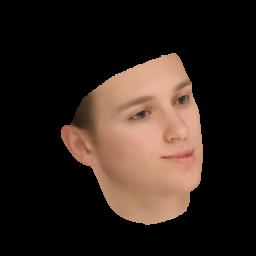
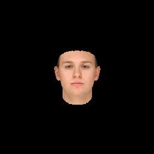
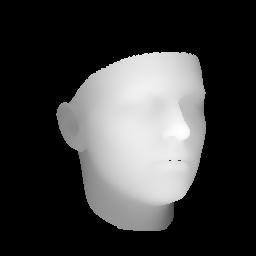

# face3d: Python tools for processing 3D face

## Introduction

Hope this helps & you enjoy it.  ^_^


## Structure

```python
# Since triangle mesh is the most popular representation of 3D face, 
# the main part is mesh processing.
mesh/             # written in python(numpy)
|  io.py                 # read & write obj
|  vis.py                # plot mesh
|  transform.py          # transform mesh & estimate matrix
|  light.py              # add light & estimate light(to do)
|  render.py             # obj to image using rasterization render

# When can not use vercorization to optimize, loops in python are too slow to use. 
# So write core parts(loops) in c++, then use cython to compile them for python api.
mesh_cython/      # written in c++(cython)
|  render.py             # the same API as in mesh/render.py, with faster speed.
|  light.py              # the same API as in mesh/light.py, with faster speed.
|  mesh_core*            # c++ codes of core parts.

# 3DMM is one of the most popular methods to generate & reconstruct 3d face.
morphabel_model/  # witten in python(numpy)
|  morphable_model.py    # morphable model class: generate & fit
|  fit.py                # estimate shape&expression parameters. 3dmm fitting.
|  load.py               # load 3dmm data
```


## Examples:

`cd ./examples`

* **3dmm**.  `python 2_3dmm.py`

  left:     random example generated by 3dmm

  right:  fitting face with 3dmm using 68 key points

   

* **transform.**  `python 3_transform.py`  
  left:  

  fix camera position & use orthographic projection.  (often used in reconstruction)

  then transform face object: scale, change pitch angle, change yaw angle, change roll angle

  right: 

  fix obj position & use perspective projection(fovy=30).  (simulating real views)

  then move camera position and rotate camera: from far to near,  down & up, left & right, rotate camera

   

* **light**.   `python 4_light.py`  

  single point light: from left to right, from up to down, from near to far

  

* **image map** `python 6_image_map.py`  

  render different attributes in image pixels.

  : depth, pncc, uv coordinates

    

* **uv map** `python 7_uv_map.py`

  render different attributes in uv coordinates.

  : colors(texture map), position(2d facial image & corresponding position map)

  

     


## Getting Started

### Prerequisite

- Python 2 or Python 3 

- Python packages:
  * numpy 
  * skimage (for reading&writing image)
  * scipy (for loading mat)
  * matplotlib (for show)
  * Cython (for compiling c++ file)


### Usage

1. Clone the repository

    ```bash
    git clone https://github.com/YadiraF/face3d
    cd face3d
    ```

2. Compile c++ files to .so for python use (ignore if you use numpy version)

    ```bash
    cd face3d/mesh_cython
    python setup.py build_ext -i 
    ```

3. Prepare **BFM** Data (ignore if you don't use 3dmm)

   see [Data/BFM/readme.md](https://github.com/YadiraF/face3d/blob/master/examples/Data/BFM/readme.md)

4. Run examples

    (examples use cython version, you can change `mesh_cython` into `mesh` to use numpy version)

    ```bash
    cd examples
    python 1_pipeline.py 
    ```

   

